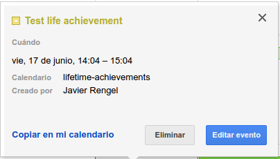

### Work in progress

## Description
Lifetime-achievements is a service powered by Slack and Google calendar
that uses a bot to read and create events on Google Calendar so you can keep track of your achievements.



This project is basically a Slack to Google Calendar service.

E.g:

```
#lifetime-achievement channel
@rephus: > Created new project called lifetime-achievement
```

    Comments in slack must be prepend with `>`

## Config

### Create Google Calendar OAUTH2 API key

Add `GOOGLE_CLIENT`, `GOOGLE_SECRET` and `GOOGLE_CALLBACK` to .env from your
Google cloud service.

### Login on the service using Google OAUTH

Go to `/auth` to login using Google OAUTH,
once you are logged in, copy your `refresh token` (see logs) and the
calendar id from the list of calendars in `/calendar` you want to write events in;
both in `.env`

## How to run

```
npm install
node lifetime-achievements.js
```
